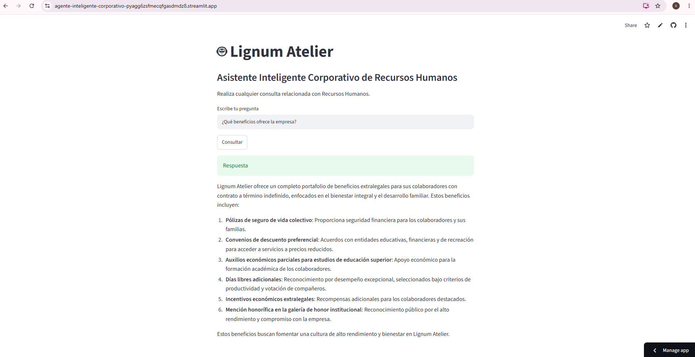

# 🤖 Lignum Atelier - Asistente Inteligente Corporativo de Recursos Humanos

## 📋 Descripción general del proyecto

Lignum Atelier es un asistente inteligente corporativo desarrollado para apoyar al área de Recursos Humanos mediante el uso de Inteligencia Artificial y la arquitectura **Retrieval-Augmented Generation (RAG)**.

El objetivo principal del proyecto es permitir que los colaboradores consulten políticas, procedimientos, beneficios, reglamentos y demás información interna de Recursos Humanos de forma rápida, precisa y confiable, utilizando lenguaje natural.

A diferencia de un chatbot tradicional, este asistente no responde utilizando conocimiento general del modelo de lenguaje, sino que fundamenta cada respuesta en una base de conocimiento corporativa almacenada en un archivo CSV. De esta manera se garantiza que las respuestas correspondan únicamente a la información autorizada por la organización.

El sistema está diseñado para responder únicamente consultas relacionadas con Recursos Humanos, evitando generar información inventada cuando la respuesta no existe dentro de la base documental.

---

# 🏢 Contexto de la empresa

**Lignum Atelier** es una empresa dedicada al diseño, fabricación y comercialización de muebles premium para el hogar, caracterizada por combinar procesos artesanales e industriales para ofrecer productos de alta calidad.

Para fortalecer la comunicación interna y optimizar la consulta de información por parte de sus colaboradores, la empresa decidió implementar un asistente inteligente especializado en Recursos Humanos.

Este asistente centraliza toda la documentación del área de Gestión Humana y permite que cualquier colaborador pueda resolver dudas relacionadas con vacaciones, incapacidades, permisos, certificados laborales, beneficios, reglamentos internos y demás procesos administrativos.

---

# 🎯 Objetivos del proyecto

## Objetivo general

Desarrollar un agente inteligente basado en la arquitectura RAG capaz de responder consultas de Recursos Humanos utilizando únicamente información almacenada en una base documental.

## Objetivos específicos

- Centralizar la información del área de Recursos Humanos.
- Implementar búsqueda semántica mediante embeddings.
- Utilizar FAISS como base vectorial para recuperar la información más relevante.
- Generar respuestas claras, profesionales y fundamentadas en documentos internos.
- Evitar la generación de información falsa (hallucinations).

---

# 🏗 Arquitectura de la solución implementada

El proyecto implementa una arquitectura **Retrieval-Augmented Generation (RAG)**, la cual combina recuperación de información con modelos de lenguaje.

El flujo de funcionamiento es el siguiente:

```
                    Usuario
                       │
                       ▼
               Escribe una pregunta
                       │
                       ▼
                  main.py
                       │
                       ▼
              Retriever (FAISS)
                       │
         Recupera los documentos
         más relevantes del CSV
                       │
                       ▼
                 Prompt Template
                       │
        Se construye el contexto
                       │
                       ▼
              Modelo de Cohere
                       │
                       ▼
          Generación de la respuesta
                       │
                       ▼
                    Usuario
```

## Componentes del proyecto

### Loader

Carga el archivo CSV que contiene toda la base de conocimiento.

Archivo:

```
loader.py
```

---

### Splitter

Divide la información del CSV en pequeños fragmentos (chunks) para mejorar la recuperación semántica.

Archivo:

```
splitter.py
```

---

### Embeddings

Convierte cada fragmento de texto en un vector numérico utilizando el modelo de embeddings de Cohere.

Archivo:

```
embeddings.py
```

---

### Base Vectorial

Los embeddings son almacenados temporalmente en una base vectorial FAISS para realizar búsquedas por similitud semántica.

Archivo:

```
vectorstore.py
```

---

### Retriever

Recupera los documentos más relevantes para responder la pregunta del usuario.

Archivo:

```
retriever.py
```

---

### Prompt

Construye el contexto que será enviado al modelo de lenguaje.

Además, define reglas importantes como:

- responder únicamente usando el contexto;
- no inventar información;
- responder con lenguaje profesional;
- indicar cuando la información no existe.

Archivo:

```
prompt.py
```

---

### Agente RAG

Integra todos los componentes anteriores utilizando LangChain.

Archivo:

```
agent.py
```

---

### Programa principal

Coordina todo el funcionamiento del sistema e inicia la conversación con el usuario.

Archivo:

```
main.py
```

---

# 📁 Estructura del proyecto

```
Agente-Inteligente-Corporativo/

│
├── src/
│   ├── agent.py
│   ├── chat.py
│   ├── embeddings.py
│   ├── loader.py
│   ├── prompt.py
│   ├── retriever.py
│   ├── splitter.py
│   └── vectorstore.py
│
├── documento_base.csv
├── requirements.txt
├── main.py
└── README.md
```

---

# 🛠 Tecnologías y herramientas utilizadas

| Tecnología | Descripción |
|------------|-------------|
| Python 3.12 | Lenguaje principal del proyecto |
| LangChain | Construcción de aplicaciones RAG |
| LangChain Community | Integraciones para carga de documentos y FAISS |
| LangChain Cohere | Integración con modelos de Cohere |
| Cohere API | Modelo de lenguaje y generación de embeddings |
| FAISS | Base de datos vectorial |
| CSVLoader | Carga del archivo CSV |
| RecursiveCharacterTextSplitter | División de documentos |
| PromptTemplate | Construcción del prompt |
| RunnableParallel | Orquestación de la cadena RAG |

---

# ⚙ Instalación

## 1. Clonar el repositorio

```bash
git clone https://github.com/usuario/Agente-Inteligente-Corporativo.git
```

---

## 2. Ingresar al proyecto

```bash
cd Agente-Inteligente-Corporativo
```

---

## 3. Crear un entorno virtual

Windows

```bash
python -m venv .venv
```

---

## 4. Activar el entorno virtual

```bash
.venv\Scripts\activate
```

---

## 5. Instalar dependencias

```bash
pip install -r requirements.txt
```

---

## 6. Configurar la API Key de Cohere

Crear un archivo llamado

```
.env
```

y agregar

```env
COHERE_API_KEY=TU_API_KEY
```

---

# ▶ Ejecución del proyecto

Ejecutar el siguiente comando:

```bash
python main.py
```

Al iniciar aparecerá:

```
============================================================
🤖 Lignum Atelier
Asistente Inteligente Corporativo de Recursos Humanos
============================================================

Escribe tu consulta o escribe 'salir' para finalizar.
```

---

# 📚 Base de conocimiento

La información utilizada por el agente se encuentra en el archivo

```
documento_base.csv
```

Esta base documental contiene información relacionada con:

- Historia de la empresa
- Misión
- Visión
- Valores
- Reglamento interno
- Código de conducta
- Vacaciones
- Incapacidades
- Permisos
- Licencias
- Certificados laborales
- Viáticos
- Beneficios
- Seguridad y Salud en el Trabajo
- Contratación
- Dotación
- Evaluaciones de desempeño
- Capacitación
- Preguntas frecuentes de Recursos Humanos

---

# 💬 Ejemplos de preguntas

El asistente puede responder consultas como:

- ¿Cómo solicito vacaciones?
- ¿Cómo reporto una incapacidad médica?
- ¿Cuál es la política de viáticos?
- ¿Cómo solicito un certificado laboral?
- ¿Qué beneficios ofrece la empresa?
- ¿Cómo solicito un permiso personal?
- ¿Qué hago si pierdo mi carné corporativo?
- ¿Cuál es la misión de Lignum Atelier?
- ¿Qué documentos debo presentar para mi contratación?
- ¿Cómo funciona la evaluación de desempeño?

---

# 💡 Ejemplos de respuestas generadas por el agente

### Consulta

```
¿Cómo solicito vacaciones?
```

### Respuesta

> Para solicitar vacaciones en Lignum Atelier debes realizar la solicitud con al menos treinta días calendario de anticipación a través de la plataforma de Gestión Humana, seleccionando el módulo de Autogestión del Empleado y diligenciando la solicitud con las fechas correspondientes.

---

### Consulta

```
¿Qué beneficios ofrece la empresa?
```

### Respuesta

> Lignum Atelier ofrece beneficios como póliza de vida colectiva, convenios educativos, descuentos con entidades aliadas, auxilios para educación superior, días libres por desempeño e incentivos económicos para colaboradores destacados.

---

### Consulta

```
¿Cómo reporto una incapacidad médica?
```

### Respuesta

> El colaborador debe informar inmediatamente a su jefe directo y al área de Seguridad y Salud en el Trabajo. Posteriormente deberá enviar el certificado médico expedido por la entidad de salud correspondiente dentro del plazo establecido por la empresa.

---

### Consulta

```
¿Qué hago si pierdo mi carné corporativo?
```

### Respuesta

> Debes reportar inmediatamente la pérdida al área de Seguridad Corporativa para bloquear los accesos y posteriormente solicitar la reposición del carné ante Gestión Humana.

---

# 🚫 Restricciones del asistente

El agente fue diseñado para:

- responder únicamente consultas relacionadas con Recursos Humanos;
- utilizar exclusivamente la información almacenada en la base de conocimiento;
- evitar inventar información cuando una respuesta no se encuentra documentada;
- mantener un lenguaje profesional, claro y respetuoso.

---

# ☁️ Despliegue del Proyecto

El **Agente Inteligente Corporativo de Recursos Humanos** fue desplegado exitosamente en **Streamlit Community Cloud**, permitiendo acceder al sistema desde cualquier navegador web sin necesidad de instalar dependencias o ejecutar el proyecto localmente.

## 🌐 Aplicación en producción

Puedes acceder al asistente desde el siguiente enlace:

**https://agente-inteligente-corporativo-pyagg6zsfmecqfgasdmdz8.streamlit.app/**

## 📷 Evidencia del despliegue

La siguiente captura muestra la aplicación ejecutándose correctamente en la nube.



> **Nota:** La imagen `streamlit-deploy.png` debe ubicarse dentro de la carpeta `images` del repositorio.

---

# 📁 Estructura final del proyecto

```text
Agente-Inteligente-Corporativo/
│
├── images/
│   └── streamlit-deploy.png
│
├── src/
│   ├── agent.py
│   ├── chat.py
│   ├── embeddings.py
│   ├── loader.py
│   ├── prompt.py
│   ├── retriever.py
│   ├── splitter.py
│   └── vectorstore.py
│
├── documento_base.csv
├── app.py
├── main.py
├── requirements.txt
├── README.md
└── .gitignore
```

---

# 🔗 Enlaces del proyecto

### 📂 Repositorio en GitHub

**https://github.com/Camila1028/Agente-Inteligente-Corporativo**

### 🚀 Aplicación desplegada

**https://agente-inteligente-corporativo-pyagg6zsfmecqfgasdmdz8.streamlit.app/**
---
# 👩‍💻 Autor

**María Camila Suárez Cardona**

Proyecto desarrollado como implementación de un **Asistente Inteligente Corporativo basado en la arquitectura Retrieval-Augmented Generation (RAG)** utilizando Python, LangChain, Cohere y FAISS.
